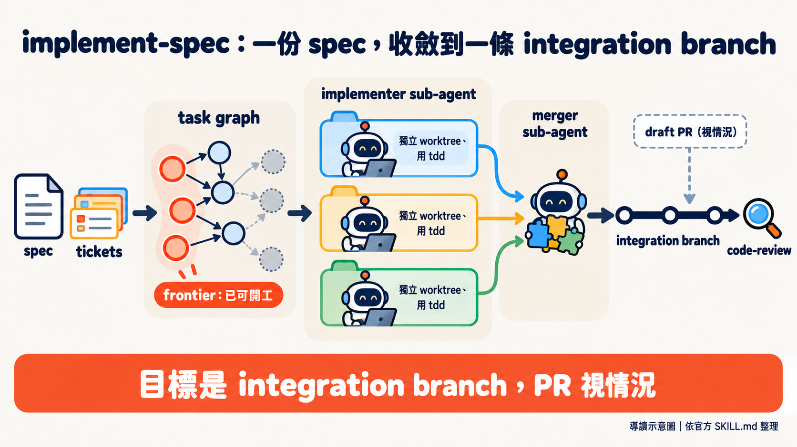
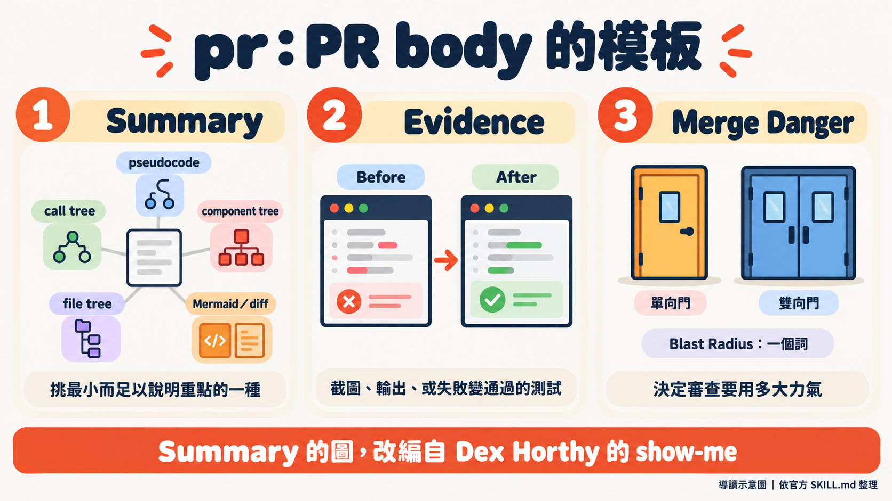
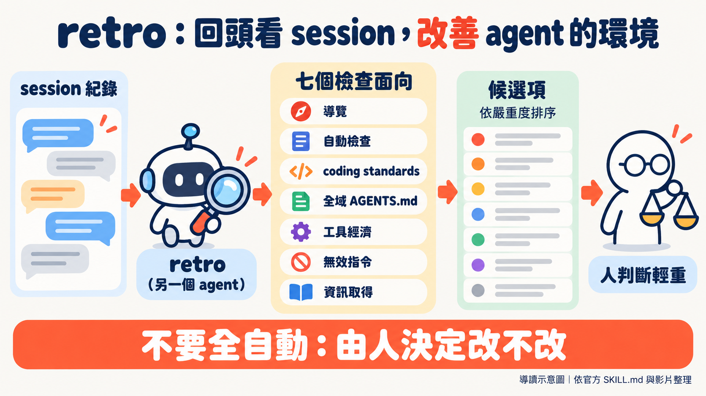

Matt Pocock 在影片後半段，把新做好的 `/retro` 對準自己的一個 repo 跑。清單最上面的發現是：他的 agent 查出 1.3.0 這個 release 為什麼缺漏，接著沒有先問他，就直接發了一個（[00:11:19](https://www.youtube.com/watch?v=BsJGo1wFTvQ&t=679s)）。他說這件事他不太在意，隨時可以再切新的 release（[00:12:41](https://www.youtube.com/watch?v=BsJGo1wFTvQ&t=761s)）。

編者讀這支影片，覺得三個新 skill 都落在同一個環節：agent 做完事情之後，人要怎麼接手。implement-spec 收斂一大批 ticket 的成果，pr 決定交給人審的時候看到什麼，retro 則是做完之後再叫另一個 agent 回頭檢討。這是編者的讀法，講者沒有這樣總結；glossary 更名不在這條線上。

> **這篇怎麼讀**：除特別標明外，文中的做法與看法都是 Matt 在影片裡的自述，官方 repo 的內容會標明。時間點可跳到影片對應位置（取自字幕檔，可能略有出入）。逐字稿是自動轉寫，專有名詞已校正。影片結尾他推薦自己在 aihero.dev 開的 AI coding 課程（[00:14:12](https://www.youtube.com/watch?v=BsJGo1wFTvQ&t=852s)），這是商業利益，請留意。

## 這是誰的 skill，這次發了什麼

Matt Pocock 的 [GitHub 個人頁](https://github.com/mattpocock)自述是「TypeScript wizard」，正在做 Total TypeScript（一門 TypeScript 課程），曾任職 Vercel 與 Stately。他的 [skills repo](https://github.com/mattpocock/skills) 副標是「Skills for Real Engineers. Straight from my .agents directory.」，也就是他自己平常給 coding agent 用的 skill 直接公開。

官方 release 列表上，[v1.3.0](https://github.com/mattpocock/skills/releases/tag/v1.3.0) 發在 2026 年 10 月 4 日，影片隔天上線。三個 skill 一次「畢業」進 Engineering 分類：`implement-spec`、`pr`、`retro`。另外還有 `CONTEXT.md` 改名為 `GLOSSARY.md` 的更動。

## 一、implement-spec：誰來顧那個迴圈

Matt 處理大工作的方式分兩層：一份 spec 說明要去哪裡，一組 ticket 把路線切成能在單一 coding agent 裡跑完的小段。全塞給同一個 agent，會進入他說的 dumb zone，可能碰到 auto compact。他承認 auto compact 愈來愈好，但還是覺得拆 ticket 比較乾淨（[00:00:54](https://www.youtube.com/watch?v=BsJGo1wFTvQ&t=54s)）。

ticket 切好之後，誰負責一張一張派出去？他列了三種做法，這裡整理成表（編者整理，並非講者原圖）：

| 做法 | 誰顧迴圈 | Matt 的評價 |
|---|---|---|
| 手動 loop | 使用者本人：做 ticket 1、等、清 context、再做 ticket 2 | 自己像個 for loop，"not really workable"（[00:01:40](https://www.youtube.com/watch?v=BsJGo1wFTvQ&t=100s)） |
| deterministic loop | 一支腳本，逐張讀 ticket 並呼叫 implement | 每次跑法一致、可靠、便宜，他推薦大多數人用這個；但設定複雜、要很有耐心調整，他認為超出初學者範圍（[00:01:49](https://www.youtube.com/watch?v=BsJGo1wFTvQ&t=109s)） |
| implement-spec | 一個 agent 當協調者，用 sub-agent 實作每張 ticket | 他想給初學者一個折衷：由 agent 代替人顧迴圈。他說這比 deterministic loop 差，因為不是每次都一樣；但是進入 AFK（人離開鍵盤）工作流程的好起點（[00:03:08](https://www.youtube.com/watch?v=BsJGo1wFTvQ&t=188s)） |

第三種做法能成立，他說是因為最近才變得可行：sub-agent 現在也能再生 sub-agent，以前有點被削弱，現在能力與協調者相當（[00:02:47](https://www.youtube.com/watch?v=BsJGo1wFTvQ&t=167s)）。這是他的說法。

官方 [SKILL.md](https://github.com/mattpocock/skills/blob/main/skills/engineering/implement-spec/SKILL.md) 的核心概念是，ticket 不是一串步驟，是帶有阻塞關係的 task graph，因此隨時有一批「已經可以開工」的 ticket（官方稱為 frontier）。流程共九步：

1. 讀 spec 與 ticket，弄清楚 task graph。
2. 可選：派探索 sub-agent 事先查資料，筆記存在 repo 之外。
3. 建 integration branch。
4. 每張 ticket 交給 implementer sub-agent，各自在獨立的 worktree 與分支，用 `tdd` 實作。
5. 做完的由 merger sub-agent 併入 integration branch。
6. frontier 有變，就再派新的 implementer。
7. 全部完成後對 integration branch 跑 `code-review`，由單一 sub-agent 修掉問題。
8. 有 draft PR 就標為 ready for review；沒有就依 tracker 的方式結案，回報分支。
9. 清掉所有 worktree。

這個 skill 要使用者手動呼叫，不會被模型自動觸發。

有一處口述和官方不同。Matt 在影片裡說，最後會得到「一個 PR」，並把它標成 ready for review（[00:04:18](https://www.youtube.com/watch?v=BsJGo1wFTvQ&t=258s)）。官方文件現在寫的是，目標是單一 integration branch：issue tracker 靠 PR 結案、或使用者要求時，才在第一次 merge 後開 draft PR；沒有 PR，就依 tracker 的方式結案並回報分支。v1.3.0 的 release 說明直接寫著 "The goal is now the integration branch, not a PR"。使用時以官方文件為準。

他最後補了兩句。這個 skill 他用的頻率比預期高，尤其在還沒建好 deterministic script、沒把「軟體工廠」調好的專案上（[00:04:23](https://www.youtube.com/watch?v=BsJGo1wFTvQ&t=263s)）。而它只是一個基本版本，stacked PR 之類的做法都可以自己換（[00:04:41](https://www.youtube.com/watch?v=BsJGo1wFTvQ&t=281s)）。

## 二、pr：先給圖，再給證據，最後標風險

Matt 認為，PR 仍然是工作進入 main 的主要瓶頸，所以 `pr` 這個 skill 的目標是讓人類審查盡可能輕鬆（[00:05:28](https://www.youtube.com/watch?v=BsJGo1wFTvQ&t=328s)）。skill 本身只做一件事：提供 PR body 的模板。

官方 [SKILL.md](https://github.com/mattpocock/skills/blob/main/skills/engineering/pr/SKILL.md) 的模板只有三個標題，Merge Danger 底下再分兩個欄位：

1. **Summary**：用「最小而足以說明重點的呈現方式」。邏輯用 pseudocode，執行流程用 call tree，介面結構用 component tree，大範圍重構用淺層 file tree，另可用 Mermaid 或 diff。這個選單改編自 Dex Horthy 的 `show-me`，[CREDITS.md](https://github.com/mattpocock/skills/blob/main/skills/engineering/pr/CREDITS.md) 說明是「幾乎逐字」複製進來，Matt 在影片裡也說自己是 Dex 的粉絲（[00:05:02](https://www.youtube.com/watch?v=BsJGo1wFTvQ&t=302s)）。
2. **Evidence**：改動前後的對照，可以是截圖、輸出、或從失敗變成通過的測試。
3. **Merge Danger**：Door 欄位標出這個 PR 是單向門還是雙向門，可附說明；Blast Radius 欄位官方要求用一個詞形容，另可補充可能的後果。

Matt 說 Evidence 是學會信任 agent 輸出的關鍵（[00:05:55](https://www.youtube.com/watch?v=BsJGo1wFTvQ&t=355s)）。他的觀察是，要求 agent 拿出證據，常常讓它多跑一次測試，或在環境允許時多截一張圖，帶回執行期的資訊，證明改動真的在做它以為自己在做的事。不要求的話，agent 很容易回一句「這應該行，因為我讀過程式碼了」（[00:06:15](https://www.youtube.com/watch?v=BsJGo1wFTvQ&t=375s)）。他接著說，自己愈來愈著迷於「驗證」這件事，尤其是最近和 Lauren（Lauren Tan，即 Poteto）的那場訪談之後（[00:06:22](https://www.youtube.com/watch?v=BsJGo1wFTvQ&t=382s)）。那場訪談影片在[這裡](https://www.youtube.com/watch?v=MN9dGgmLyso)。

門的比喻用來決定審查要用多大力氣。雙向門是能輕易退回的改動；單向門會對外界造成影響，例如刪資料，或還原代價很高。Blast radius 小的雙向門，他說真的不必審得太用力。他還說，這一段放在 PR 底部，大概是審查的人第一或第二個會看的東西，所以很重要（[00:06:59](https://www.youtube.com/watch?v=BsJGo1wFTvQ&t=419s)）。

他展示了自己 repo 裡一個由這個 skill 產生的 PR：把兩個本質相同的演算法合併成一個（[00:07:16](https://www.youtube.com/watch?v=BsJGo1wFTvQ&t=436s)）。PR 裡有刪除與新增的檔案、呼叫關係，以及一個真實案例的前後對照：改動前沒有開場介紹，改動後有，這也是他要的行為變更（[00:07:30](https://www.youtube.com/watch?v=BsJGo1wFTvQ&t=450s)）。Merge danger 標為雙向門，blast radius 小。

這個 skill 是模型自動觸發的類型。Matt 說它是他見過最穩定被自動呼叫的 skill 之一，至少在 Opus 5.5 上，似乎每次都會觸發（[00:07:59](https://www.youtube.com/watch?v=BsJGo1wFTvQ&t=479s)）。這是他個人的使用觀察，其他模型或環境未必如此。他的建議很直接：已經有自己的 PR body skill，也可以從這個偷點東西走。

## 三、CONTEXT.md 改名 GLOSSARY.md

`domain-modeling` 這類 skill 原本寫入 `CONTEXT.md`，名字來自 DDD 的 bounded context 概念，靈感源自 Eric Evans 的《Domain-Driven Design》。Matt 說他現在不太走 DDD 那套流程，實際上仍在用，只是不掛名。而 context 這個詞太籠統：不容易讓 agent 在對的時機把它讀進來，對使用者也很混淆。加上檔案裡的內容最後只剩詞彙表，所以乾脆叫詞彙表（[00:08:25](https://www.youtube.com/watch?v=BsJGo1wFTvQ&t=505s)）。

官方 release 說明列得比影片細：改名不只 `CONTEXT.md`，連 `CONTEXT-MAP.md` 也改為 `GLOSSARY-MAP.md`，而且檔名是大寫的 `GLOSSARY.md`；影響到 `domain-modeling`、`grill-with-docs`、`tdd`、`triage`、`pr` 等多個 skill。已有舊檔的人，必須自己 `git mv` 成新名稱，因為 skill 之後只找 `GLOSSARY.md`。Matt 在影片裡也提醒，很多 skill 靠這個檔案才能用對的領域語言，所以一定要更新（[00:09:19](https://www.youtube.com/watch?v=BsJGo1wFTvQ&t=559s)）。順帶一提，前面的 `pr` skill 就規定要用 `GLOSSARY.md` 裡的使用者領域語言寫 PR。

## 四、retro：叫另一個 agent 回頭看這一個

`retro` 的起點，是他覺得自己的 skill 組合把太多工作丟給使用者：維護 `AGENTS.md`、維護 skill、讓 repo 省 token、讓環境對 agent 安全、設好 lint 與導覽（[00:09:46](https://www.youtube.com/watch?v=BsJGo1wFTvQ&t=586s)）。他自己平常就在替 repo 做這些事，於是把它包成一個 skill。retro 是 retrospective 的簡稱，可以對目前的 session、前一個、或一批 session 執行。官方文件說明，它建議改善的是 agent 的工作環境，不是程式碼本身。

讀真實 session 的好處，他說是能看到 agent 自己可能迴避不談的低效（[00:10:51](https://www.youtube.com/watch?v=BsJGo1wFTvQ&t=651s)）。他在畫面上秀出 André Staltz（@andrestaltz）10 月 4 日的一則貼文（[00:10:56](https://www.youtube.com/watch?v=BsJGo1wFTvQ&t=656s)）：`/retro` 是 game changer，自己的 agent 其實撞上各種沒被察覺的問題，但靠著 agentic cleverness and persistence，功能還是以某種方式做出來了，現在他可以從可靠的基礎重新出發。Matt 認為，agent 不像它該有的那樣會抱怨，也不會試著修自己的錯，所以得另找一個 agent 回頭看那些 session。

官方 [SKILL.md](https://github.com/mattpocock/skills/blob/main/skills/engineering/retro/SKILL.md) 列出七個檢查面向：

1. 導覽：agent 找檔案花多久、有沒有隱藏的相依。
2. 自動檢查：能不能用 lint、型別、測試抓到錯誤。
3. coding standards：要不要給審查 agent 新規則。
4. 全域 `AGENTS.md` 的健康度。
5. 工具經濟：有沒有昂貴的呼叫，或耗 token 的自製工具。
6. 無效指令：steering 檔案裡不影響行為的句子。
7. 資訊取得：agent 缺不缺關鍵資訊。

對機械性的違規，官方建議優先建立 deterministic 檢查（linter 規則、pre-commit hook、CI），`CODING_STANDARDS.md` 只留給真正要判斷的事。完全沒有 guardrail 的 repo，本身就算一項發現。

Matt 在自己專案跑出來的結果，影片裡唸了這幾項（[00:11:19](https://www.youtube.com/watch?v=BsJGo1wFTvQ&t=679s) 起）：

- 開頭那個 release：agent 在使用者選定修法之前，就執行了不可逆的公開動作。
- repo 裡有 pnpm check 腳本，但沒有任何東西去執行它，建議加 CI。
- 長 session 經過 compaction 後 context 遺失；他用 animatic 做影片草稿，建議把重複的指令搬進 animatic skill。這條他說一定會做。
- 他為課程影片管理系統做的自製 CLI 浪費 token，另一個 `wiki` CLI 不在本機 PATH 上。

關於 release 那條，影片裡有個細節和現況對不上。Matt 說，現在去看 release 列表，只有 1.3.1，沒有 1.3.0（[00:11:30](https://www.youtube.com/watch?v=BsJGo1wFTvQ&t=690s)）。但本文撰寫時，官方 release 列表同時有 v1.3.0 與 v1.3.1，時間只差約一分鐘，v1.3.1 多了一條針對 `ask-matt` 的修正。逐字稿沒有說明原因。

retro 把開頭那個 release 列為最嚴重，他自己判斷其實沒那麼糟，所以 retro 的設計是讓人參與判斷（human in the loop）。他說大家看了都想自動化（[00:12:54](https://www.youtube.com/watch?v=BsJGo1wFTvQ&t=774s)），他的原話是「No, you don't want to automate this」。理由是自動化會讓 agent 陷入一個迴圈：不斷找出誤報，不斷試著修，最後把 repo 與 agent 帶往不該去的方向（[00:12:58](https://www.youtube.com/watch?v=BsJGo1wFTvQ&t=778s)）。他建議的用法是抽樣：想到好一陣子沒跑，就挑幾個最近的 session，特別是出過怪事的那幾個（[00:13:16](https://www.youtube.com/watch?v=BsJGo1wFTvQ&t=796s)）。

這個「不要自動化」是他本人的建議；官方 SKILL.md 的最後一步是「依嚴重度把候選項呈現給使用者」，沒有任何字句禁止自動化。他還說，定期跑 retro 之後，自己的 token 效率與產出品質都大幅提升（[00:14:04](https://www.youtube.com/watch?v=BsJGo1wFTvQ&t=844s)），沒有附數據。

## 重點結論與實際啟示

以下是編者整理，依據都來自上面各節，不是講者的原話。

- **想試 implement-spec**：先確認自己有 spec 和 ticket（官方說明它接在 `/to-spec` 與 `/to-tickets` 之後），並設好 issue tracker；沒設的話，skill 會叫你先跑 `/setup-matt-pocock-skills`。預期成果是一條 integration branch，PR 是視情況才有。
- **不想碰整套 skill**：`pr` 的模板可以單獨借走，Summary、Evidence、Merge Danger（含 Blast Radius）這三段，用在自己的 PR 範本裡也成立。
- **用到 glossary 的 skill**：升級後檢查舊的 `CONTEXT.md` 與 `CONTEXT-MAP.md`，用 `git mv` 改成大寫的新名稱，否則 skill 找不到。
- **跑 retro**：定期抽樣來跑，不要全自動；清單出來由人判斷輕重，像 Matt 對 release 那條的取捨。

## 來源清單

- 影片：[New Skills! v1.3 brings /pr, /implement-spec, and /retro](https://www.youtube.com/watch?v=BsJGo1wFTvQ)（Matt Pocock 頻道，2026-10-05，14:34）。
- 官方 repo：[mattpocock/skills](https://github.com/mattpocock/skills)
  - [v1.3.0 release](https://github.com/mattpocock/skills/releases/tag/v1.3.0)（2026-10-04）、[v1.3.1 release](https://github.com/mattpocock/skills/releases/tag/v1.3.1)
  - [implement-spec/SKILL.md](https://github.com/mattpocock/skills/blob/main/skills/engineering/implement-spec/SKILL.md)
  - [pr/SKILL.md](https://github.com/mattpocock/skills/blob/main/skills/engineering/pr/SKILL.md)、[pr/CREDITS.md](https://github.com/mattpocock/skills/blob/main/skills/engineering/pr/CREDITS.md)
  - [retro/SKILL.md](https://github.com/mattpocock/skills/blob/main/skills/engineering/retro/SKILL.md)
- 講者背景：[GitHub：mattpocock](https://github.com/mattpocock)（2026-10-05 讀取，講者自述）。
- Lauren Tan 與 Poteto 的對應：[訪談影片](https://www.youtube.com/watch?v=MN9dGgmLyso)，以及 [pstack 的 plugin.json](https://github.com/cursor/plugins/blob/main/pstack/.cursor-plugin/plugin.json)（作者欄為 Lauren Tan）。
- Dex Horthy 的 `show-me`：見上方 `pr/CREDITS.md` 的說明。
- André Staltz 的貼文：取自影片畫面（2026-10-04 12:28 PM），本文未另在 X 上開啟原貼文。
- 以上官方內容皆於 2026-10-05 讀取；repo 之後可能再變動。
